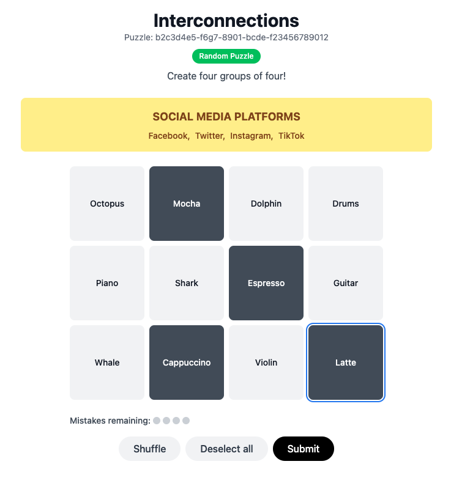

# Interconnections 🧩

A fully functional clone of the New York Times Connections game built with React 19 and Tailwind CSS. Challenge yourself to find four groups of four related words from a grid of 16 words!



## 🎮 Features

- **106 Unique Puzzles** - Months of engaging content with diverse themes
- **Smart "One Away" Detection** - Get helpful feedback when you're close to the answer
- **URL-Based Sharing** - Share specific puzzles with friends via unique URLs
- **Random Puzzle Selection** - Discover new challenges with smart exclusion logic
- **Toast Notifications** - Smooth slide-down animations for user feedback
- **Responsive Design** - Play seamlessly on desktop, tablet, and mobile
- **Mistake Tracking** - Visual indicator showing remaining attempts
- **Word Selection Memory** - Keeps your selections when you're "one away"

## 🚀 Getting Started

### Prerequisites

- Node.js (v14 or higher)
- npm or yarn

### Installation

1. Clone the repository:
```bash
git clone https://github.com/yourusername/interconnections.git
cd interconnections
```

2. Install dependencies:
```bash
npm install
```

3. Start the development server:
```bash
npm start
```

4. Open [http://localhost:3000](http://localhost:3000) in your browser

## 🎯 How to Play

1. **Select Words**: Click up to 4 words that you think belong together
2. **Submit**: Hit the Submit button when you have exactly 4 words selected
3. **Find Groups**: Discover all four categories before making 4 mistakes
4. **Get Hints**: Look for the "One away!" notification when you're close
5. **Share**: Copy the URL to share specific puzzles with friends

### Difficulty Levels

Categories are color-coded by difficulty:
- 🟢 **Green**: Easiest
- 🟣 **Purple**: Medium
- 🟡 **Yellow**: Hard  
- 🔵 **Blue**: Hardest

## 🛠️ Technology Stack

- **React 19** - Modern React with hooks
- **React Router DOM** - URL-based puzzle sharing
- **Tailwind CSS** - Utility-first styling
- **Local JSON** - 106 puzzle files with diverse themes

## 🗂️ Project Structure

```
src/
├── components/
│   ├── ConnectionsGame.jsx      # Main game logic and state
│   ├── WordGrid.jsx            # 4x4 word selection grid
│   ├── CategoryResult.jsx      # Found category display
│   ├── GameControls.jsx        # Shuffle, Deselect, Submit buttons
│   └── RandomPuzzleRedirect.jsx # Home page redirect logic
├── utils/
│   └── puzzleLoader.js         # Puzzle loading and selection
└── App.jsx                     # Router setup

public/
└── puzzles/                    # 106 JSON puzzle files
```

## 🧩 Puzzle Themes

Our 106 puzzles include diverse categories like:

- **Entertainment**: Disney characters, Marvel heroes, musicians
- **Food & Drink**: Coffee terms, pizza types, ice cream flavors
- **Technology**: Programming languages, video games, apps
- **Science**: Ocean animals, space objects, weather terms
- **Sports**: Olympic events, board games, chess terms
- **Word Play**: Compound words, prefixes, rhyming words
- **Pop Culture**: Social media, streaming services, brands

## 🔗 URL Sharing

Each puzzle has a unique shareable URL:
- Home: `https://yoursite.com/` (redirects to random puzzle)
- Specific puzzle: `https://yoursite.com/puzzle/d7829759-c5fe-434a-ad38-8aee6e545df2`

## 🎨 Game Mechanics

### Smart Feedback System
- **Correct Match**: Category revealed, words removed from grid
- **One Away**: Toast notification appears, selections remain for easy adjustment
- **Incorrect**: All selections cleared, mistake counter increments
- **Game Over**: After 4 mistakes or completing all categories

### Enhanced UX Features
- **Word Selection Memory**: When "one away," your selections stay active
- **Smart Random**: Random button never picks the current puzzle
- **Responsive Grid**: Adapts perfectly to any screen size
- **Touch Friendly**: Optimized for mobile gameplay

## 🏗️ Development

### Available Scripts

- `npm start` - Start development server
- `npm run build` - Build for production
- `npm test` - Run test suite
- `npm run eject` - Eject from Create React App

### Adding New Puzzles

1. Create a new JSON file in `public/puzzles/` with a unique GUID filename
2. Follow the puzzle format:
```json
{
  "id": "your-guid-here",
  "date": "2025-XX-XX",
  "items": [
    {
      "name": "Category Name",
      "words": ["Word1", "Word2", "Word3", "Word4"]
    }
    // ... 3 more categories
  ]
}
```
3. Add the GUID to `getAvailablePuzzleIds()` in `puzzleLoader.js`

## 📝 Puzzle Creation Guidelines

Want to contribute new puzzles? Follow these **CRITICAL RULES** to ensure quality and functionality:

### 🚨 Must-Follow Rules (Game-Breaking if Violated)

1. **NO DUPLICATE WORDS** - Each puzzle must have exactly 16 unique words
   - Every word appears only once per puzzle
   - Duplicates make puzzles unsolvable

2. **EXACT COUNT** - 4 categories × 4 words each = 16 total words

3. **UNIQUE GUID** - Generate a new GUID for each puzzle file

### 📋 Quality Standards

4. **Clear Categories** - All 4 words must obviously belong together
5. **No Overlap** - Words shouldn't fit multiple categories  
6. **Balanced Difficulty** - Mix easy and challenging categories
7. **Broad Appeal** - Use commonly known references, avoid niche topics

### ✅ Validation Checklist

Before submitting any puzzle:
- [ ] Exactly 16 unique words (check for duplicates!)
- [ ] 4 categories with 4 words each
- [ ] Unique GUID filename and id
- [ ] All words clearly belong to assigned category
- [ ] No ambiguous words that fit multiple categories
- [ ] Valid JSON format
- [ ] Added GUID to `puzzleLoader.js`

### 🎯 Great Category Examples

- **Word Play**: Compound words, rhyming words, prefixes/suffixes
- **Pop Culture**: Movie franchises, musicians, TV shows
- **Everyday Items**: Kitchen tools, school supplies, clothing
- **Science**: Animals, planets, body parts, elements
- **Abstract**: Colors, emotions, time periods

**Remember**: Quality over quantity! Well-tested puzzles are infinitely better than broken ones.

For complete rules and examples, see `CLAUDE.md`.

## 🤝 Contributing

1. Fork the repository
2. Create a feature branch: `git checkout -b feature/amazing-feature`
3. Commit changes: `git commit -m 'Add amazing feature'`
4. Push to branch: `git push origin feature/amazing-feature`
5. Open a Pull Request

## 📝 License

This project is licensed under the MIT License - see the [LICENSE](LICENSE) file for details.

## 🙏 Acknowledgments

- Inspired by the [New York Times Connections](https://www.nytimes.com/games/connections) game
- Built with [Create React App](https://create-react-app.dev/)
- Styled with [Tailwind CSS](https://tailwindcss.com/)

## 📱 Screenshots


*The main game interface showing word selection and category discovery*

---

**Enjoy playing Interconnections!** 🎉

Found a bug or have a suggestion? [Open an issue](https://github.com/yourusername/interconnections/issues) or contribute to make the game even better!